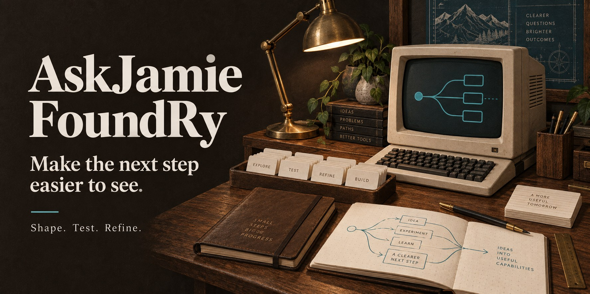

# AskJamie FoundRy

**A careful place to turn ideas into useful capabilities.**

[](https://okhp3.github.io/askjamie-foundry/)

**[Explore the FoundRy](https://okhp3.github.io/askjamie-foundry/)** · **[Run the workbench](#run-the-workbench)** · **[Visit AskJamie](https://askjamie.bot/)**

Shape. Test. Refine.

Portable Agent Skills are the default product. Compose them with separately
verified plugins and connectors for the platforms people choose. Existing
Custom GPTs and prompts remain conversion inputs. Start with the
[skill-first operating model](docs/skill-first-foundry.md).

AskJamie FoundRy is the workshop behind assistants, decision guides, and steady
workflows. Bring an idea, define who it helps, shape its behavior, and keep the
evidence beside the result. Export a governed package when it is ready for review.

The public site introduces the FoundRy. The authoring application runs on your
computer, with private drafts and local storage.

## Find your way in

| I want to… | Start here |
|---|---|
| See what the FoundRy is about | [Public orientation](https://okhp3.github.io/askjamie-foundry/) |
| Open the authoring application | [Local workbench](http://127.0.0.1:8765), after [starting the server](#run-the-workbench) |
| Understand the tools and workflow | [Workbench guide](docs/workbench.md) |
| Explore the broader AskJamie world | [AskJamie portfolio](https://askjamie.bot/) |
| Find the banner, social card, or icons | [Presentation assets](#presentation-assets) |

## What you can make

- **Portable skills with a clear trigger.** Export a self-contained skill folder,
  source provenance, and conversion notes. Plugin and connector exports include
  an unverified adapter plan that requires separate host packaging and testing.
- **Assistants with a clear brief.** Define purpose, audience, instructions,
  constraints, and an output contract. Export editable instructions and
  specifications for your chosen deployment platform.
- **Decision tools you can follow.** Build question-and-result paths, preview
  them, and run graph tests. Export a standalone offline decision runner.
- **Guided workflows.** Turn a recurring task into an ordered, portable checklist.
- **Packages with their context intact.** Keep source references, revisions,
  evaluation records, and governance proposals together for review.

The durable asset is the capability and its knowledge architecture.
A Custom GPT, Copilot agent, Gemini Gem, website, or local agent is a deployment surface.

## Run the workbench

Use Python 3.11 or newer. From the repository root:

<details>
<summary><strong>Windows / PowerShell</strong></summary>

```powershell
py -3 -m venv .venv
.\.venv\Scripts\python.exe -m pip install -r requirements.txt
.\.venv\Scripts\python.exe -m workbench --port 8765
```

</details>

<details>
<summary><strong>macOS / Linux</strong></summary>

```bash
python3 -m venv .venv
.venv/bin/python -m pip install -r requirements.txt
.venv/bin/python -m workbench --port 8765
```

</details>

Then **[open the workbench](http://127.0.0.1:8765)**. Stop the server with `Ctrl+C`.
No frontend build, provider key, or paid inference service is needed.

Create a project, define its behavior, add a decision flow or workflow, record
evaluations, then save, validate, and export. The [operating guide](docs/workbench.md)
covers the full flow, backups, import, project duplication, and confirmed deletion.

## Public orientation. Private making.

| Surface | What belongs there |
|---|---|
| **[Public website](https://okhp3.github.io/askjamie-foundry/)** | Read-only orientation, ecosystem links, and shareable brand assets. Built only from [`public/`](public/). |
| **[Local workbench](workbench/)** | Single-user authoring, revisions, evaluations, and private exports. Python serves a plain HTML/CSS/JavaScript interface; SQLite stores drafts in ignored `.foundry-data/`. |
| **[Governed registry](registry/index.yaml)** | Nine child-repository records with lineage and visibility controls. A catalog entry alone does not establish remote existence or operation. |

The workbench binds to loopback only and makes no model-provider calls.
Assistant and workflow checks examine responses you supply; they are not live
model evaluations. Skillz selections are metadata references, not installed or
executed skills. Decision tests execute the decision graph.

Drafts and generated packages stay private by default. Client protection and
permanent-private locks remain in force. A valid export still needs the separate
review and approval required for public graduation or deployment.

## Presentation assets

One visual identity, from the README to the browser tab to a shared link.
The banner is conceptual artwork, not an application screenshot.

| Asset | Preview or source |
|---|---|
| **README banner and social card** | [Full-size JPEG](public/assets/social-preview.jpg), 1774 × 887 |
| **Browser favicon** | [Scalable SVG](public/favicon.svg) · [ICO fallback](public/favicon.ico) · [16 px](public/icons/favicon-16.png) · [32 px](public/icons/favicon-32.png) |
| **Apple touch icon** | [180 px PNG](public/icons/apple-touch-icon.png) |
| **Bookmark / home-screen icons** | [192 px](public/icons/icon-192.png) · [512 px](public/icons/icon-512.png) · [Maskable 512 px](public/icons/icon-maskable-512.png) |
| **Safari pinned-tab mark** | [Monochrome SVG](public/icons/safari-pinned-tab.svg) |
| **Web manifest** | [Name, theme, scope, and icons](public/site.webmanifest) |
| **Sharing and search metadata** | [Canonical URL, Open Graph, Twitter card, and structured data](public/index.html) |
| **Brand standards** | [PDF](assets/brand/askjamie-brand-standards.pdf) · [Editable Word document](assets/brand/askjamie-brand-standards.docx) |
| **Recovered project avatar and cover alternatives** | [SVG/PNG source assets](assets/brand/README.md), with separate service-setting updates |

The icon and manifest links identify the **public orientation site**. They do not
install the private workbench or promise offline use. See the
[asset guide](docs/presentation-assets.md) for provenance, sizes, GitHub's separate
repository social-preview setting, and publication checks. Public-site changes
appear after a separately approved manual Pages release.

## Around the workshop

| Area | What you will find |
|---|---|
| [`workbench/`](workbench/) | Local application and public Skillz metadata snapshot |
| [`capabilities/`](capabilities/) | Reviewed public capability subtree namespace; private capabilities stay outside this checkout |
| [`_template/`](_template/ABOUT.md) | Starter scaffold for governed child repositories |
| [`registry/`](registry/README.md) | Child catalog and candidate intake decisions |
| [`schemas/`](schemas/README.md) | Manifest and registry validation contracts |
| [`docs/`](docs/README.md) | Governance, naming, migration, operating guides, and ecosystem research |
| [`scripts/`](scripts/README.md) | Validation and maintenance utilities |
| [`tests/`](tests/) | Application and governance regression checks |
| [`.agents/skills/`](.agents/skills/) | Project-local Agent Skills and evaluation resources |
| [`assets/`](assets/README.md) | Shared AskJamie brand standards |
| [`public/`](public/) | Read-only website and presentation assets |

To scaffold a child repository, begin with the [template guide](_template/ABOUT.md),
replace its placeholders, preserve lineage and visibility controls, and update the
[registry](registry/index.yaml). Follow the [naming conventions](docs/naming-conventions.md)
and [migration guide](docs/migration-guide.md).

## Check your work

With the virtual environment activated, run:

```bash
python scripts/validate-manifest.py manifest.yaml
python scripts/check-registry.py
python scripts/build-public-artifact.py --build
python -m unittest discover -s tests -v
```

Dependencies are pinned in [`requirements.txt`](requirements.txt). See the
[technology inventory](docs/technology-inventory.md) for runtime, dependency,
and update policy, and [compatibility runs](https://github.com/OKHP3/askjamie-foundry/actions/workflows/technology-compatibility.yaml)
for current CI evidence.

Source changes go through protected `main` and required checks. Pages publication
is a separate [manual release](.github/workflows/pages.yaml). If a publication
needs correcting, follow the [Pages recovery procedure](docs/workbench.md#recovering-a-bad-pages-publication);
private workbench data is never a recovery input.

## Part of a larger workshop

```text
OKHP3/OverKill-Hill
  -> OKHP3/AskJamie-FoundRy
    -> Governed AskJamie child repositories
```

[OverKill Hill FoundRy](https://github.com/OKHP3/OverKill-Hill-FoundRy) supplies the
mentor pattern. [Glee-fullyTools FoundRy](https://github.com/OKHP3/Glee-fullyTools-FoundRy)
is a regional peer. [Skillz](https://okhp3.github.io/skillz/) is the shared shelf.
Each FoundRy keeps its own purpose and runtime.

The [ecosystem map](docs/ecosystem-map.md), [current-state assessment](docs/current-state-and-maturation.md),
and [parity matrix](docs/parity-matrix.md) explain the relationships and what remains
planned. [AGENTS.md](AGENTS.md) is the contributor authority; the
[collaboration protocol](docs/agent-collaboration.md) records how work is claimed
and handed off. [Changelog](CHANGELOG.md) · [License](LICENSE.md).

The [delegation series](docs/agent-delegation-series-2026-10-05.md) and
[machine-readable duties](docs/agent-delegation-series-2026-10-05.json) preserve
the next tasks, dependencies, allocation and required evidence. Private worker
packets remain outside this public repository.

Built by **Jamie Hill**, within [OverKill Hill P³](https://overkillhill.com/).

*Clear context. Useful capabilities. A more considered next step.*
